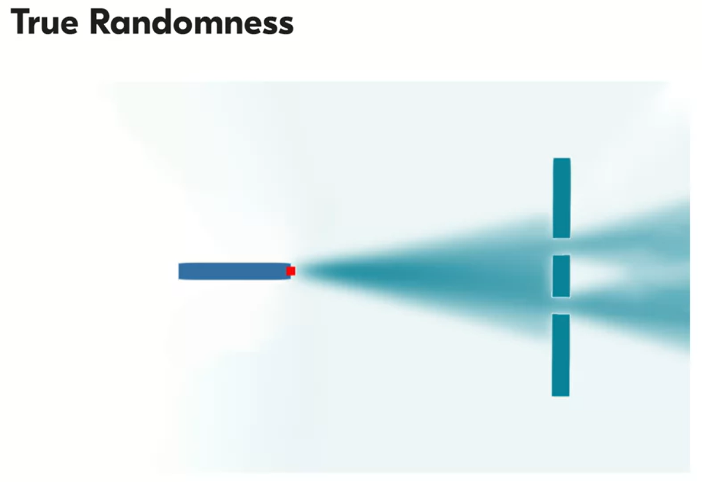
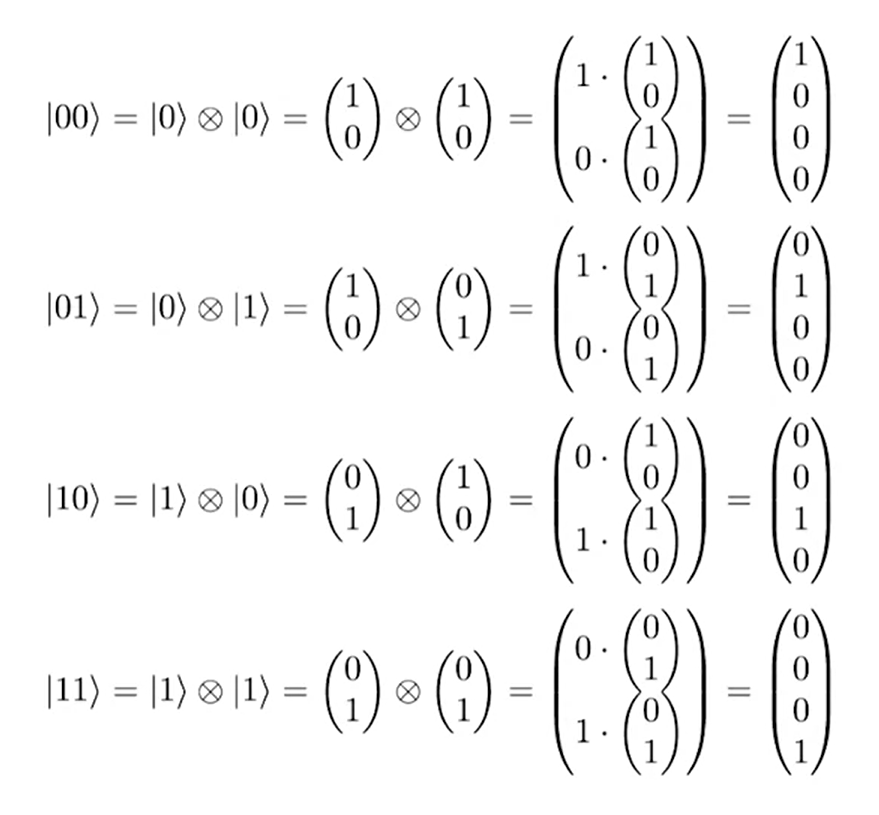

# Quantum Less

Es muy difícil explicar la algoritmia cuántica sin dejar de lado ecuaciones diferenciales y la solución de una ecuación diferencial, los espacios vectoriales, matrices, dimensiones y mucho del álgebra lineal.

Explicar el reino de la mecánica cuántica ocasionalmente conlleva una situación donde una explicación simple pero incorrecta sirve para contar sobre el fenómeno y una explicación correcta pero complicada que sirve para intentar entender a profundidad el fenómeno.

La mejor forma de explicar el poder del cómputo cuántico es entendiendo el modelo matemático subyacente que está detrás, inicialmente para comprender su potencial.

Del modelo matemático tenemos tres aspectos relevantes para describir un proceso físico.

Es decir las implementaciones de un computador cuántico requieren estos 3 aspectos:

- Estados continuos
- Verdadera aleatoreidad
- Interferencia

## Estado Continuo

¿Qué es un estado continuo?

Un qubit es un vector unitario en un **espacio de Hilbert** en 2D . Un qubit puede pensarse en su forma más simple como un circulo de dos dimensiones que nos permite representar un bit pero con infinitos estados intermedios, cada punto de la circunferencia puede ser el valor del Qubit.

En la algoritmia cuántica básica es de interés tener estos estados positivos o negativos

La representación de cualquier punto de esta circunferencia se puede representar mediante un ángulo:

Sin embargo, un valor real de un qubit está representado perfectamente por dos números complejos como los siguientes:

$$\ket{\phi} = \frac{1}{\sqrt{2}}\ket{0} + \frac{i}{\sqrt{2}}\ket{1}$$

Este estado es una representación que no corresponde a un punto del círculo como tal, si no a una rotación que sucede en contra de las manecillas del reloj, pasando por todos los puntos del ciruclo.

El bit clásico solo almacena dos valores, 1 o 0, mientras que un Qubit almacena valores de 1 a infinitos. Como ejemplo para entender el poder del cómputo cuántico es posible representar el movimiento de un péndulo que puede tener direcciones horizontales o verticales, lo cual puede representar un 0 o 1, pero un péndulo también puede rotar, esto está representado como los números complejos.

¿Porque no simular entonces esto en un computador clásico?. 

Debido a qué el modelo matemático trae cosnigo más aspectos para describir el proceso físcio que sucede.

## True Randomness

La aleatoreidad de un evento como tirar una monedad a nivel clásico podría medirse si se tiene conocimiento de todas las variables que influyen en el sistema, es decir el aire, la forma en que es lanzada la moneda y demás varibles físicas. Inclusive si no conocemos todas las variables, el sistem en si mismo las conoce, es decir, humanamente se percibe como aleatorio, pero para el universo no lo es verdaderamente, el universo puede predecirlo.

En quantum computing, necesitamos una forma aleatoreridad que no puede ser predicha. 

El experimento de Yung de la doble rendija buscaba estudiar la naturaleza ondultaroia de la luz, una vez los los electrones son lanzados por los slits o rendijas, si quisieramos predecir el resultado de que detector golpea tendríamos que medir la posición y el momentum del electrón justo en el lugar inicial del que sale. Pero no es posible saberlo por el **Principio de incertidumbre de Heisemberg**, si se conoce  la posición se tiene incertidumbre de su momentum, debido a esto, ni el universo mismo sabe a dónde irá el electrón y golpear.

La percepción de la aleatoreidad en el mundo macroscópico es fácil de imaginar si tuvieramos la suficiente información para predecir un resultado.

A nivel cuántico podemos imaginarla aunque no tengamos toda la información disponible.

Tomemos por ejemplo, digamos que el experimento de la doble rendija sucede en dos universos exactamente iguales, en uno de los universos, el electrón golpea el detector de arriba y en el otro universo el detector de abajo. En vez de la noción de aleatoreidad, el electrón no escoge su camino, siempre toma ambos caminos pero en diferentes universos, no existe tal cosa como aleatorio, pero para el observador si se percibe como tal.

Un evento futuro es verdaderamente aleatorio cuando no está definido en el estado actual del universo.

En el experimento de la doble rendija, tenemos entonces que existe un área de mayor probabilidad de medir la posición de un electrón, sin emabrgo no tenemos idea de lo que ocurre en medio del inicio y el final de la emisión del electrón. No existe tal cosa como la trayectoria en este nivel. Según los físicos podemos tener infinitos estados intermedios.

Es decir, si hicieramos un paralelo con computadores, tendríamos un mismo computador en diferentes universos ejecutando la misma tarea, digamos descifrar una contraseña mediante un rute force.

Si encontramos la forma de manejar lo que sucede en el medio, para que las otras computadoras procesen diferentes combinaciones, inmediatamente el algoritmo es millones de veces más efectivo.

Un qubit en estado de $\ket{+}$ está simultáneamente en un estado de $\ket{1}$ y $\ket{0}$, por esto ese estado se llamda superpuesto, porque está en ambas posiciones simultáneamente. Es decir, si pasamos un bit como input, si pasamos por el estado $\ket{+}$ se lo pasamos a una función $f(x)$ simultáneamente esto sucederá para ambos posibles estados 0, 1. 

Esto duplica el poder de cómputo por Qubit. Es decir, un Qubit no solo puede almacenar multiples valores, si no que puede almacenar 2 valores simultáneamente, o mejor $2^n$

Es importante entender el modelo del gato de Shoringer, el gato en la caja está vivo y muerto simultáneamente, pero nosotros solo percibimos uno de estos estados.

---------EJEMPLOS DEL GATO DE SHORDINFGER--------------- Y EXPLICACIÓN DE SUPERPOSICIÓN-----------

## Interference

La percepción del espacio está ligado a nuestra mente, pero Imanuel Kant pensaba que no tenía que ver con la interpretación de la realidad.

Hugh Everett III propuso la teoría del multiverso, una especie de stacks en el que suceden cosas de manera paralela, universos identidcos, los universos paralelos existen en función de cada evento aleatorio que sucede.

---------------------- AMPLIAR ESTOS CONCEPTOS DEL MULTIVERSO--------------------

Es decir cuando vemos un evento aleatroio, nuestras copias en diferentes universos se dividirarn y diferiran, es decir que actúan y computan diferente. No podemos interacutar entre estos universos porque estamos en el nuestro, y en teoría no podríamos recolectar los la información de este "cómputo distribuido", pero si es posible en ocasiones através del proceso físico llamado **Interferencia** 

Podemos revisar el experimento de Young y su interferómetro.

Al lanzar electrones con una pistola de electrones, en el experimento de la doble rendija, se tenía que al tapar una rendija, la distribución de los electrones era normal, pero cuando estaban abiertas las dos generaban este patrón de interferencia, como si existiera algo que hiciera que se comportara diferente.

Feyman, acuño al electrón una propiedad que es relevante en el momento de entender este comportamiento, un "reloj" que con sus manceillas describe un estado que tiene dos direcciones opuestas.

- $\ket{a_1}$: Corresponde al estado del electrón solo
- $\ket{A_1}$: Corresponde al estado del  universo, excepto el electrón.

- $\ket{A_1}=\ket{A_2}$: Significan que son dos universos identicos.

Es decir, el elctrón en ambos universos es el mismo, pero de signo contrario. Es decir, puedo describir mediante esta interferencia o suma de interferencias ocurridas en diferentes "multiversos", y esto me describe el estado superpuesto, con el cual puedo hacer cómputos, y luego hacerlos interferir podemos extraer infromación de estos cómputos.

* **El cómputo cuántico trata en dividir los caminos, hacer algo en medio de nuestro interés, y luego hacerlos interferir, para leer los resultados.**

El problema con la interferencia es que supongamos que tenemos $\ket{A_1}=\ket{A_2}$, si existe algún evento aleatorio antes de que la interferencia tome lugar perderemos el 0, que de esta igualdad, por lo tanto un reto de la computación cuántica es:

1. **Rápido**:  Necesitamos hacer el cómputo rápido para disminuir la probabilidyad de un evento del ambiente.
2. **Frío**: Disminuir tempratura del ambiente, ambientes fríos evolucionan más lento, esto disminuye probabilidad de evento externo.
3. **Aislado**: Evitar interacción con ambiente.

## Doble Slit y la naturlaeza dual de la luz.

El experimento entonces, por un lado si se interpreta con particulas, tenemos que la distribución total de aciertos en la pantalla es la suma de ambos slits por los que pasan las balas, particualas. 

Mientras que teniendo el mismo experimento con ondas, la distribución total no es para nada la suma de ambas distribuciones.

Intensidad, es poder por unidad de área, proviene de las ecuacioens de la itnerpreteación de la luz como una Onda. Es decir, en términos de la luz, estamos calculando como los fotones, envían un cantidad puntual de energía. La intensidad es el cuadrado de la amplitud.

El patrón de interferencia de la luz, demuestra que también es una onda.

Este gráfico de intensidad indica también que siendo proporcional al cuadrado de la amplitud de esa onda puedo estudiar la probabildiad de encontrar o detectar un fotón en esa área, y que hay una onda unida a ello, esto es la **función de onda**.

¿Pero donde está esa onda?. Sabemos que los fotones entonces se comportan como partículas y tomando consideración los multiversos donde la misma partoucla tiene una estructura de onda. 

Este experimento se repitió por Louis De Broglie, usando electrónes cuya particula tiene radio, por lo que se pensaba que era una particula. Las amplitudes fueron diferentes, pero el resultado lo mismo. Pareciera que todo en el universo tuviera una función de onda.

## Wave Functions

Primero hay que entender el concepto de probabilidad y distribución. 

La densidad de probabilidad corresponde a ese intervalo, y como necesitamos que la probabilidad total sea 1, en una curva tendríamos infinitos puntos. Por ellos integramos.

Para particulas masivas el pico se vería estricho y alto, podríamos explicar el lugar, posción y momento con más facilidad en física clásica. Pero para partículas muy pequeñas tenemos estas ondas más amplias, donde no tenemos una noción de espacio. 

Si la onda posee esta intensidad que es proporcional al cuadrado de la amplitud, y dentro del área bajo la curva tenemos que la probabilidad total  de encontrar la partícula debe ser 1, entonces nuestro dominio de cálculo se reduce a las **funciones integrales cuadras**

-----Que son estas funciones integragles cuadradas?--------

**Es decir la posición de una partícula en el mundo cuántico está dada por una probabilidad, no por una posición.**

## Normalización

El proceso de hacer que para hacer que lso valores poditivos de una función sean la probabilidad correcta de distribución es la noramlziación.

Debido a que la integral de probabilidad cuando es 1, significa que es un evento seguro, tenemos A como evento incierto, pero no nulo.

Usamos la normalización porque no queremos un vector espacio de infinito dimensionalmente.

### Linear Vector Space

Puede definirse tanto para números complejso como reales. 
Un vector espacio cualquiera $F$ es un conjunto de vectores, solo se llama vector espacio si:

1. Podemso multiplicar cualquiera elemento dle conjunto por un escalar y el reusltado pertenece al conjunto.

$$\alpha*A\epsilon F$$

2.  Podemos sumar dos elementos del conjunto, y tener otro elemento del conjunto.

La **base** de un vector espacio es el número de elementos, a esto se le llama la dimensioanldad del espacio

Por ejemplo este gráfico anterio tiene una dimensioalidad de 2, debidoa que su base solo tiene dos elementos. Existen bases ortonormales, como las bases verdes

_____

## Squared Integrable Functions

Queremos entonces definir un vector escpacio en un conjunto de funciones de onda. 

Para obtener la porbabilidad de distribución correcta necesitamos normalizar nuestra función.

Independientemente de que escalar se multiplique, esto no hará cambios físicos,

______

La dimensionalidad de vector espacio en funciones integrables cuadradas tiene un valor de infinito.

## Measurements

Entonces del experimento de la doble rendija tenemos qué, al lanzar fotones, no sabemos que dofotdetctor golpeara, debido a que su posición exacta en el espacio no está definida,  pero si, es una función de ondacuadrado del cual determina la distribución de probabilidad.

Pero después de golpear el detector, la función de arriba se vuelve la de abajo,a este proceso se le llama el **colapso de función de onda** , la medida no afecta la función de onda, afecta el estado del que observa.

Si estudiaramos el pico estrecho aún podemos tratarlo como una función de onda, si quisieramos encontrar la posición exacta, tendríamos que buscar el límite cuando tiende a 0. Este límite se llama **Función Delta de Dirac**

Esta función permite explicar como se forman las bases ortonormales dentro de nuestro vector espacio de funciones cuadradas integrables.

Es decir, una función de onda se puede representar en términos de sus bases ortonormales mediante las funciones delta, despue´s de la medida en un caso ideal la función de onda se convierte para nosotros en una delta function,  la representación infinita de deltas se reduce a 1 elemento base.

La medida transforma decompsociiones en bases, en un vector de estas bases, este vector es escogido aleatoriamente de acuerdo a la distribcuión inicial.

Las funciones de onda se pueden medir. En segundo lugar, el procedimiento de medición puede darnos diferentes resultados aleatoriamente. Tercero, el conjunto completo de estos diferentes resultados forman las bases ortonormales en el espacio de las funciones de onda. Ahora, este es un punto muy importante. Podemos medir diferentes cosas sobre una partícula, podemos medir su posición en el espacio, su momento, su polarización, su nivel de energía, etc. Pero para cualquier medida de este tipo, el conjunto de todos los resultados posibles forman bases ortonormales en algún espacio vectorial donde reconsideramos la función de onda medida. Cuarto, después de la medición, la función de onda colapsa subjetivamente para nosotros a uno de estos estados básicos. La probabilidad de que el vector base sea elegido por el procedimiento de medición se define por el cuadrado del coeficiente para este vector base en la descomposición inicial. Este conjunto de posibles resultados que forma las bases en el espacio vectorial de la función de onda y define las características de nuestro procedimiento de medición, los físicos lo llaman observable. Más precisamente, define lo que los físicos llaman un observable

Para medir la polarización de la luz podemos utilizar un filtro de polarización, que deja pasar los fotones o los refleja, dependiendo de su polarización. ¿Cuál es la dimensionalidad del espacio vectorial correspondiente a este observable? 2 Dos opciones, o pasa o no.

## Sumary

- La función de onda se refiere a la descripción de la mecánica cuántica de una partícula. 

- Funciones de onda forman un vector espacio lineal. En cualquier vector space podemos escoger una base ortnormal.

- La elección de estas bases ortonormales es lo que en física se denomina un obserbable.Que está coenctado fuermente al concepto de medida.

- Cuando realizamos una medición  de alguna propiedad de la particula obtenemos de un vector de estas bases ortonormales

- Probabilidad definida por la apmplitud de la función de onda.

- Delta functions son funciones asociadas a las posiciones de una partícula. Las bases para estos obserbables son continuas y se llaman Delta Dirac Functions. Se denominal con la letra R y Q, de la notación de Langrange.

## State Space.

Un estado es una abstracción.

- Las funciones de onda forman un vector space, las funciones dentro de ese vector space son funciones integrables cuadradas.

Tenemos una propiedad muy conveniente con lienar vector spaces, no importa que clase de objeto lso linear vector space estén representando. Los lvs son una abstracción que nos permitirá olvidar la naturaleza física y matemática de los vectores. 

Una vez sabemos que son vectores, podemos usar algebra lienal para manipularlos.

$$E = \{e_i\}^N_{i=1}$$

Tenemos una función de onda o cualquiera de las decompsociones en sus bases, consideremos un espacio dimensional finito de dimensionalidad $N$, cada vector de esa suma es un vector base multiplicado por una amplitud o probabilidad

$$ x = \sum^N_{i=1}x_ie_i $$

Donde:

- $x$ = La función de onda
- $x_i$ = Amplitudes de probabilidad
- $e_i$ = Vectores bases
- $N$ = Dimensionalidad del espacio.

Ahora consideremos un espacio especial que está compuesto por columnas de n digitos o también llamados **Vector Columns**

$$ e_1= \begin{pmatrix}1 \\ 0 \\0\\...\\ 0\end{pmatrix},  e_2= \begin{pmatrix}0 \\ 1 \\0\\...\\ 0\end{pmatrix},e_2= \begin{pmatrix}0 \\ 0 \\3\\...\\ 0\end{pmatrix},  e_{n-1}= \begin{pmatrix}0 \\ 0 \\...\\1\\ 0\end{pmatrix}, e_{n}= \begin{pmatrix}0 \\ 0 \\...\\0\\ 1\end{pmatrix}$$

Cada elemento de e, ubica el 1, en la posición n. Para $e_1$ tenemos el 1 al principio del vector, el segundo al segundo lugar hasta el n-ésimo elemento.

Debido a que sabemos que es un **Vector Space** podemos definir dos operaciones:

- Operación por un escalar:

$$ \alpha\begin{pmatrix}x_1\\ x_2\\x_3\\...\\ x_n\end{pmatrix}= \begin{pmatrix}\alpha x_1\\\alpha x_2\\ \alpha x_3\\...\\ \alpha x_n\end{pmatrix} $$

- La suma de dos vectores. Esta operación es conmutativa.

$$\begin{pmatrix}x_1\\ x_2\\x_3\\...\\ x_n\end{pmatrix}+\begin{pmatrix}y_1\\y_2\\y_3\\...\\ y_n\end{pmatrix}=\begin{pmatrix}x_1+y_1\\ x_2+y_2\\x_3+y_3\\...\\ x_n+y_n\end{pmatrix}$$

Para cada elemento base e tenemos una columna que representa el vector. Con estos vectores podemos determinar que vector columna corresponde a neustra función de onda inicial.

De esta suma obtenemos un solo vector con todas las amplitudes.

$$x = \sum^N_{i=1}x_ie_i=\begin{pmatrix}x_1\\ 0\\0\\...\\ 0\end{pmatrix}+\begin{pmatrix}0\\x2\\0\\...\\ 0\end{pmatrix}+\begin{pmatrix}0\\0\\0\\...\\ x_n\end{pmatrix} = \begin{pmatrix}x_1\\ x_2\\x_3\\...\\ x_n\end{pmatrix}$$

A esto anterior se le llama **Isomorfismo**, para el vector espacio de funcioens de onda construimos un vector espacio isomórfico que consiste en vectores columna con las amplitudes.

Lo que acabamos de construir es un **State Space** del sistema, y sus elementos o columnas son nuestros **Estados**. Es más conveniente trabajar con la representación de estos sistemas que trabajar con funciones de onda.

Este proceso mental de pensar cada uno de los vectores bases en una dimensión finita, peude extrapolarse a infinitas dimensiones, pero es conviente tener esta representación en un espacio finito. ¿Porqué?

## Two State Systems.  Polarization of Photons

Los Vikingos usaban una "barita" con un cristal que permitiía ubicar la posición del sol en un día nublado.

En las fotos si queremos mejorar los azules podemos usar un filtro polarizador que me permitirá variar la intensidad  de la luz.

La luz que viene directamente del sol, no está polarizada. 

### Polarización de la luz.

Podemos explicar la luz en término onda, y esto nos lleva a que la luz es una onda traversa, esto significa que la dirección de la oscilación de la onda es perpendicular a la dirección de la propagación de la onda. La dirección de la oscilación es llamado la polarización de onda.

La luz natural no está polarizada, solo sucede cuando golpea sobre una superficie.

En este caso la superficie de un lente polarizador, el arreglo molecular de este cristal forman dipolos, que están alienados con el mismo eje L.

La onda primaria una vez golpea el cristal y sus dipolos, dichas cargas interactuarán con los dipolos del material. Esta oscilación produce una segunda onda, que interfiere con la primera onda y la elimina.

Si la onda primaria es polarizada de manera ortogonal al eje de la orientación del dipolo, no se porducen  oscilaciones y no reflexión, la luz pasa através del cristal. 

Eje óptico.

Es el principio de la transparencia, materiales que oscilan y producen una segunda onda extinguirán la segunda onda después de qu ele material forme las ondas reflejadas.

## Representación de Fotón

Vamos a asumir que esta vez la dirección de la polarización no es ni ortognal, ni paralela al eje optico, si no la resultante, también vamos a estudiar solo 1 fotón, por lo que pasará o no a través del cristal. Es decir, este resultado es un **True Randomness** 

En otras palabras el fotón pasa con una probabilidad P, o se refleja con una probabilidad R, ambas probabilidades en términos de $\theta$.

$$P = \cos(\theta)^2$$
$$R = \sin(\theta)^2$$

Supongamos que un fotón tiene un ángulo de polarización de $\frac{\pi}{4}$ respecto al eje optico del cristal. ¿Cual es la probabilidad de que pase?

$$P =\cos(\frac{\pi}{4})^2$$
$$P =\cos(0,7071)^2$$
$$P = 0.5 $$

En caso de la reflexión la polarización será ortogonal. En caso el paso la polarización será colinear al eje óptico.

En el lente de la cámara podemos apreciar dos polarizadores que permiten o no el paso de luz. A este sitema se le llama polarización cruzada.

-----

El conjunto total de posibles resultados de las mediciones forman las bases en el estado-espacio,  para un fotón polarizado solo tenemos dos posibles resultados, el fotón pasa o el fotón se refleja de polarizados. Las bases son exactamente de dos elementos.

A lso sistemas cuyos esta-space tienen exactamente dos dimensiones les llamamos **Qubit**.  La elección de la base es simplemente dato por la rotación del polarizador.

Es decir para $e_1$ si la rotación está orientado con el eje optico se permite le paso del fotón, probabilidad de 1. En $e_2$ no se permite el paso del fotón, una probabilidad de 0. Los demás se puede representar como una suma "weigthed" de las bases de estos dos vectores.

Es decir, entre el $\ket{1}$ y $\ket{0}$ tenemos un $\ket{+}$ Estos vectores son muy importante en el pensamiento cuántico computacional, serán llamados vectores suma y resta respectivamente. Nacen de tener un fotón que no es ni cero ni 1, pero que podemos describirlo con un ángulo de rotación $\theta$

Estos dos vectores forman bases en el state-space y también definen el procedimeinto de la medida. Podemos entonces escoger las bases de la medida solo mediante la rotación.

- Es decir podemos entender $\ket{+}$ como un estado equiprobable de tener, 1 o 0

## Ondas y números complejos.

Por lo que sabemos de la aleatoreidad el fotón en el estado $\ket{+}$ toma ambos estados, es decir, pasa y se refleja simultáneamente, pero en difenetes universos, y nosostros percibimos subjetivamente el resultado.

Desde el punto de un vista de de la teoria ondulatoria d ela luz, el fotón es una onda.

**Ondas propagan oscilaciones**, una oscilación está descrita por la siguiente ecuación diferencial:

$$ \frac{d^2}{dt^2} = \omega^2f$$

Donde:

- $\omega$: Es la frecuencia angular de las oscilaciones.
- $f$: El parámetro que describe la oscilación armónica, por ejemplo puede ser la posición de un péndulo, hasta la intensidad de un campo electromagnético.
- $t$: Describe el tiempo, F es función del tiempo.

Podemos expresar los términos de esta ecuación en forma de funciones trigonométricas y sus derivadas

$$(\sin \omega t)^{´´} = (\omega\cos \omega t)^{´} = -\omega^2\sin\omega t$$

$$(\cos \omega t)^{´´} = (\omega\sin \omega t)^{´} = -\omega^2\cos\omega t$$

### Frecuencia Angular

Para la frecuencia angular tenemos que:

$$ f(t) = A\cos(\omega t+ \phi)$$

Donde:

- $A$: Es la amplitud de las oscilaciones
- $\omega$: Es la frecuencia angular de las oscilaciones.
- $\phi$: Define la fase de la oscilación.

Cuando f vale 0.

$$ f(0) = A\cos(\phi)$$

$$ \omega = \frac{2\pi}{4}=2\pi v$$

Hasta este punto hemos desrito las oscilacioens mecánicas, pero que pasa cuando queremos describir ondas que están descritas en términos de números complejos?. 

Para describir la interpretación de esta ecuación en término del mundo real para describir oscilacioens reales, tenemos que admitir la parte compleja.

Podemos tener la primera expresión tranformando, y luego despreciar la parte compleja, y obtenemos la expresión inicial. 

- Podemos operar con números complejos por dos razones, resulta que el cambio de fase es solo multiplicar por un escalar que no cambia el largo dle vector, no cambia el estado. 

- El hecho de que al derivar obtengo la misma expresión-

Esta propiedad permite describir las oscilacioens en números complejos.

### Describiendo la onda

Hasta este punto solo hemso descrito lo que son las oscilaciones, una onda armónica la podemos describir así:

$$ f A\cos(\omega t + \phi - kz)$$

Recordemos
- + Es el estado superpuesto.
- 0 corresponde al eje horizontal, donde el fotón oscila en esa dirección.
- 1 corresponde a una oscilación en el eje vertical

Consideremos el siguiente estado:

$$ \frac{1}{\sqrt{2}}\ket{0} + \frac{i}{\sqrt{2}}\ket{i}$$

La parte imaginaria representa la rotación de polarización en este estado, esta rotación es contra las manecillas del reloj.

$$ \frac{1}{\sqrt{2}}\ket{0} - \frac{i}{\sqrt{2}}\ket{i}$$

Este estado define la rotación a favor de las manecillas del reloj.

## Bloch Sphere Geometrical Representation

Inicialmente podemos representar el estado del fotón, alfa y beta son números complejos se pueden representar en su forma polar, es decir podemos reescribir las operaciones.

Un fotón en un state space está definido por dos ángulo, parecido a un sistema de coordenadas. En este caso el sistema de coordenadas de una esfea

En función del ángulo, suceden diferentes posicionamientos para la polarización.

Cualquier punto de la esfera puede representar puede corresponder a cualquier polarización del fotón.

Esta representación es útil para cualquier sistema cuántico de dos niveles.

## Two State systems Spin 1/2

El experimento de Stein-Gerlach facilitó descubir los spines.

Muestra que atomos tiene propiedades importante medibles ante campos magnéticos, o momento magnético. Auqnue se llame spin, estos No giran.

Por lo que lso spin son útiles en el momento de tener un sistema cuántico.

- Dos posibles representaciónV
- Verdaderamente aleatorio
- El colapso del estado de la medición.

## Entaglement y multiqubits

Un par de qubits no resuleven problemas reales, podemos tener entonces:

- $1 \ket{+}$ -> Medir
- $2 \ket{+}$ -> Medir
- $3 \ket{+}$ -> Medir

...

- $1000 \ket{+}$ -> Medir

Tendríamos por cada fotón que colapsa en sus estado bases, dos posibildades $2^1000$ , si tuvieramos 1000 fotones tendríamos ese número enorme.

El significado fídisco significa que es el tamño de las bases, un sistema de 100 fotones es descrito por un vector espacio de esa dimensionalidad.

En el cómputo clásico la data se procesa según otra, es decir, para sumar números tenemos en cuenta las unidades, luego decenas, centenas y así.En un computador cuántico no podemos leer la unformación.

Pareciera que los fotones necesitan leer la información de otros fotones sin neustra ayuda.

Imageinimos dos fotones 
- $B -> CNOT(A)$

Imaginemos que podemos hacer que el fotón A lea el estado del fotón B, cambiar el estado de A a 0 o 1, es decir, flip, si el fotón B tiene estado 1, pero no queremos hacer nada si tiene estado 0.

El condicional not aplica un cambio de valor si `x` condición.

- $\ket{+} -> CNOT(\ket{0})$

¿Qué ocurre el aplicar CNOT gate?

Desde la perspectiva del multiverso el fotón B, existe simultáneamente con ambos valores pero en diferentes universos.

A, también tiene copias en otros universos, pero en el mismo estado por ahora.

Cuando el fotón A y B interactúan, A absorbe subjetivamente copias de B. Es decir, el 0 no cambia, pero la parte que posee 1, hace el cmabio.

Después terminaremos con este estado:

Es el estado **Bell**,  este estado describe un sistema de dos particulas, estas partículas no tienen estado separados,es una superposición de sistemas de partícula, sus estados estan pegados, o entrelazados. CNOT gate es una operción entrelazante. 

## **Rydberg Atoms** 

Es otro sistema de particuals donde el radio del átomo es enorme, importa porque necesitamos particulas suficientemente alejadas para controlar estados separados,  pero cerca para que se peudan organizar.

## System Multiple Qubits

Describamos algunas operaciones antes:

 $$\ket{0} \otimes \alpha\ket{0}+\beta\ket{1}=\alpha\ket{00}+\beta\ket{01}$$

Lo anterior tiene una probabilidad definida por el vector unitario:

- $|\alpha|^2+|\beta|^2 = 1$

¿Qué pasa cuando ambos Qubits están en superposición?

$$ \alpha\ket{0}+\beta\ket{1} \otimes \sigma\ket{0}+\delta\ket{1}$$

El vector resultante:

$$ \alpha\sigma\ket{00}+\alpha\delta\ket{01} +  \beta\sigma\ket{10}+\beta\delta\ket{11}$$

Los siguientes productos tensoriales nos devuelven las columans vectores.

De esta regla anterior podemos apreciar que la posición del bit 1, está asociado con la posición de donde aparece en la columna.

# Matemática para cómputo Cuántico.

Hasta este punto existen algunas nociones que nos facilitaran realizar diferentes explicaciones sobre la naturaleza

# Vectors

# Matrix

# Complex Numbers

# Euclidean Space

# Hilbert Space

||||||||||||||||||||||||||||||||||||||||||||||||||||||||||||

# Inner Product

Hasta este punto tenemos que a un espacio vectorial lineal lo podemos sumar, y multiplicar por un escalar.

Existen condiciones para que estas operaciones se definan correctamente. Es decir, propiedades:

- $0*A = \vec{0}$ ,       $A+ \vec{0} = A$
- $\alpha(A+B) = \alpha(A) +\alpha(B)$
- $A + B =B+A$
- $(A+B)+C=A+(B+C)$
  
El producto interno o porducto escalar de dos vectores los denotaremos así, esta operación toma dos vectores y retorna un escalar, el producto punto también es u nombre que recibe.

- El producto de dos vectores cualquiera me retorna un escalar.
$$H x H = C$$

- Donde:
$$ x, y\space \epsilon \space H,  \alpha \space \epsilon \space C$$

Para estar debidamente definido el producto interno debe cumplir 3 propiedades. 

1. $x \cdot y=\vec{y\cdot x}$ Simetría Conjugada, el orden de los vectores si importa para la operación, el resultado es conjugado.
2. $x \cdot \alpha y=\alpha (y\cdot x)$ Linearidad.
3. $x \cdot x \geq 0$ Para todo vector el producto interno es mayor que cero.

## Inner Product in Euclidean Space

Si tenemos estos dos vectores x, y. Podemos realizar un iner product al multiplicar cada uno de los componentes en x, y, y sumarlos. Así obtendríamos un escalar.

$$x=\begin{pmatrix}x_1\\ x_2\\x_3\\...\\ x_n\end{pmatrix},y=\begin{pmatrix}y_1\\y_2\\y_3\\...\\ y_4\end{pmatrix}$$

$$x \cdot y = \sum^n_{i=1}x_iy_i$$

También podemos tener una interpretación geométrica del inner product:

- Podemos normalizar cualquier vector dividiendo sobre la raíz.

- Si calculamos el producto punto de dos vectores normalizados, el resultado es el coseno del ángulo generado entre esos dos vectores:

Lo anterior permite realizar un test sencillo de ortogonalidad entre los dos vectores:

- Si el producto punto d elso dos vectores es 0, significa que el coseno del ángulo entre ellos es 0. Y estos dos vectores son mutuamente ortogonales.

## Inner product in Hilbert Space.

Podemos definir el producto punto en un espacio vectorial sobre números complejos. Se definen igual a un producto interno entre dos vectores, y también considera las mismas propiedades.

Es importante comprender que no podemos imaginar de manera natural dimensiones, angulos y demás de vectores espacios, tampoco de lo que significa una distancia, pero obtenemos esta idea mediante generalización.

- El valor absoluto de un número complejo es siempre un número real.
- Si todo lo que sale del valor absoluto del coseno del ábgulo generado entre dos vectores en un espacio de hilbert, significa que no tenemos valores negativos, por lo tanto, no tenmos angulso obtusos.

- Una vez definimos estas operaciones para ángulos podemos lograr lo mismo para un espacio vectorial de funciones cuadradas integrables, es decir podemos definir cosas como largo y ángulo para dos funciones., y también decir que dos funciones son mutuamente ortogonales.

Tanto para la función real.
$$f \cdot g = \int f g $$

Como la función expresada en sus términos conjugados.
$$f \cdot g = \int f^* g $$

## Ortonormal Basis

Una base ortonormal, consiste en vectores que son mutuamente ortogonales y tienen el largo de la unidades. Es decir el producto punto, o inner product entre dos vectores debe ser 0.

$$E = {\{e_i\}}_i^n = 1$$

$$ e_i\cdot e_i = 1$$

$$i \neq j \iff e_i \cdot e_j =0 $$

La idea de bases ortonormalesCon esto tendremos una noción de los espacios conjugados.

# Conjugate Space

Consideremos un vector diferente a cero $x$ en un espacio de hilbert $\mathcal{H}$.
- $x \in \mathcal{H}$

Podemos crear una forma linear o una función lineal, expresada a partir de producto punto de dos vectoes que pertenencen a espacios de hilbert.

## Linear functional or linear Form
...

______

Podemos definir una forma lineal para un espacio de Hilbert y pasará lo mismo

En nuestro caso una función lineal tomará un vector como input, y sacará un escalar como output.

Para cada elemento $y$ la acción de función $f_x$ el producto punto de $x \cdot y$

$$f_x : y \longrightarrow x \cdot y \space \forall y\in\mathcal{H}$$

El conjunto de funciones lineales, también forma un espacio vectorial de $\mathcal{H}$, es decir el espacio conjugado de $\mathcal{H}^*$

$$f_x \in \mathcal{H}^*$$

También podemos expresar nuestros vectores en términos de la notación de Dirac.

$$\ket{x} \in \mathcal{H}$$

$$\bra{x} \in \mathcal{H}^*$$

Podremos definir un estado de un sistema cuántico mediante las funciones lineales, forma lineal.
Definiremos entonces una función lineal para Bra y el producto punto para Bra-ket :

$$f_x = \bra{x}$$
$$\braket{x|y} = x \cdot y$$

Los **Kets** los representaremos como vetores columnares. 

$$\ket{x} = \begin{pmatrix}y_1\\ y_2\\y_3\\...\\ y_n\end{pmatrix}$$

Denotamos **Bra**, como filanas de coordenadas conjugadas. Este vector de $x$ cojugado se llama **Conjugado Hermitico** del vector columna **Ket**
$$\bra{x} = \begin{pmatrix}x_1^*& x_2^*&x_3^*&...& x_n^*\end{pmatrix}$$

Tenemos que podemos expresar también nuestro producto punto entre dos vectores. Estos peudens ser elementos de un **Espacio de estados** de algún sistema cuántico.

$$\braket{x|y} =\sum_{i=1}^n{x_i^* y_i}=\begin{pmatrix}x_1^*& x_2^*&x_3^*&...& x_n^*\end{pmatrix}\begin{pmatrix}y_1\\ y_2\\y_3\\...\\ y_n\end{pmatrix}$$

Entonces el estado del sistema estará denotado como Ket.

# Hermitian Conjugation

Para cualquier escalar alfa, el conjugado hermitico es alfa conjugado.

$$\alpha^* = \bar{\alpha}$$

Es una operación reversible.
Para cualquier ket de $x$ su cojugado hermitico será bra de x.
$$\ket{x}^* = \bra{x}$$

Sucede el caso similar para bra.
$$\bra{x}^* = \ket{x} $$

# Linear Operators

Hasta ahora hemos considerado un **Espacio de estados** formado por vectores, los qubits son representados por vectores, los cuales almacenan quantum data, pero no es solo necesario almacenar la data, necesitamos poder modificar su contenido.

No basta con tenet la data almacenada, necesitamos un instrumento para modificarla, par ello tenemos a los vectores. O desde el punto de vista físico, vectores capaces de modificar el estado de un sistema.

En general un operador es una forma de mapear vectores a otros vectores. 

Dado un operador $A$ podríamos tener algo como esto:

$$A: \mathcal{H}  \longrightarrow \mathcal{H} $$
$$A(\alpha\ket{x}+\beta\ket{y}) = \alpha A\ket{x}+\beta A\ket{y}$$

Sabemos que los Qubits con los que lidiamos están en un **espacio de estados** en el que consideramos está un una dimensión finita, para un espacio vectorial finito $\mathcal{H}$ podemos tener un operador en forma de matriz cuadrada.

$$A= \begin{pmatrix}a_{11}&a_{12}&...&a_{1n}\\a_{21}&a_{22}&...&a_{2n}\\&&.\\\\&&.\\\\&&.\\a_{n1}&a_{n2}&...&a_{nn}\end{pmatrix}$$

La acción de esta matriz, u operador  sobre un vector $x$ resulta en otro vector.

$$A\ket{x}= \begin{pmatrix}a_{11}&a_{12}&...&a_{1n}\\a_{21}&a_{22}&...&a_{2n}\\&&.\\\\&&.\\\\&&.\\a_{n1}&a_{n2}&...&a_{nn}\end{pmatrix}\begin{pmatrix}x_1\\ x_2\\x_3\\...\\ x_n\end{pmatrix}$$

En este caso es una multiplicación entre vectores. Debido a que podemos multiplicar entonces de cada fila d ela matriz por la columna, podemos considerar que cada fila de la matriz representa alguna forma lineal o función lineal.

Es importante entender que podemos reconstruir una matriz operarador a partir d elos vectores base, uno por uno.

$$A\ket{e_k}= \begin{pmatrix}a_{11}&a_{1k}&...&a_{1n}\\a_{21}&a_{2k}&...&a_{2n}\\&&.\\\\&&.\\\\&&.\\a_{n1}&a_{nk}&...&a_{nn}\end{pmatrix}\begin{pmatrix}0\\ 0\\.\\1\\.\\ 0\end{pmatrix}=\begin{pmatrix}a_{1k}\\a_{2k}\\.\\.\\.\\a_{nk}\end{pmatrix}$$

- Operadores lineales en un espacio de Hilbert forman una estructura llamada álgebra. Significa que un vector en un espacio vectorial, puede ser multiplicado y aún así obtendremos un vector en un espacio vectorial.

## Operaciones con Operadores.

$$(\lambda A)\ket{x} =\lambda (A\ket{x})  = A(\lambda\ket{x})$$
$$(A+B)\ket{x} = A\ket{x} + B\ket{x} $$

En una representación matricial de los operadores:

$$A + B= \begin{pmatrix}a_{11} + b_{11}&a_{1k} + b_{1k}&...&a_{1n}+ b_{1n}\\a_{21}+ b_{21}&a_{2k} + b_{2k}&...&a_{2n}+ b_{2n}\\&&.\\\\&&.\\\\&&.\\a_{n1} + b_{n1}&a_{nk} + b_{nk}&...&a_{nn}+ b_{nn}\end{pmatrix}$$

$$\lambda A=\begin{pmatrix}\lambda a_{11}&\lambda a_{1k}&...&\lambda a_{1n}\\\lambda a_{21}&\lambda a_{2k}&...&\lambda a_{2n}\\&&.\\\\&&.\\\\&&.\\\lambda a_{n1}&\lambda a_{nk}&...&\lambda a_{nn}\end{pmatrix}$$

Así también como tenemos una representación para un escalar por un operador como en el ejemplo anterior, también tenemos una suma.

$$0_{n,n}=\begin{pmatrix}0&0&...&0\\0&0&...&0\\&&.\\\\&&.\\\\&&.\\0&0&...&0\end{pmatrix}$$

y también podemos definir un operador con signo contrario, negativo.

$$-A= \begin{pmatrix}-a_{11}&-a_{1k}&...&-a_{1n}\\-a_{21}&-a_{2k}&...&-a_{2n}\\&&.\\\\&&.\\\\&&.\\-a_{n1}&-a_{nk}&...&-a_{nn}\end{pmatrix}$$

Así mismo, toda las operaciones de conmutatividad, asociativa, distribución respecto multiplicación por un escalar.

$$A+B =B+C$$
$$(A+B) +C= A+ (B +C)=$$
$$\lambda (A+B)= \lambda A + \lambda B $$

El producto de dos operadores A y B, se comporta diferente. Para un operador $AB$ que acciona sobre un vector $x$ cualquiera, primero opero B y luego este vector resultante es accionado por A.

También aplica asociación, distribución, peor no conmutatividad.
$$(AB) \ket{x}= A(B\ket{x})$$
$$(AB)C= A(BC)=ABC$$
$$A(B+C)= AB + AC  $$

En general los operadores lienales no conmutan, significa que el orden de la aplicación importa en los casos.

$$AB \neq BA$$

Sin embargo para algunos pares de operadores esto no es del todo cierto y si conmutan. Usamos un comtuator, para saber si estos son conmutables, $[A,B]$ es el conmutator, si esa resta es 0 es por que $AB$ es lo mismo que $BA$, siginifca que los operadores A y B conmutan, desde un punto de vista físico, esto significa que es un **observable**.

$$(AB) \ket{x}= A(B\ket{x})$$
$$[AB] = AB - BA$$

