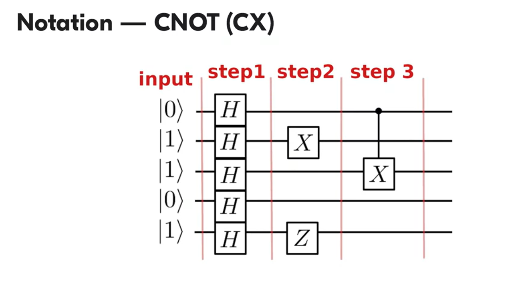

# Hermitian Operators

"Linear Functional" es una herramienta para mapear vectores a escalares. Cualquier linear functional en un espacio $\mathcal{H}$ puede ser obtenido desde los vectores de un espacio por una operación llamada **Conjugado Hermitico**. Podemos encontrar las funciones lineales mediante el vector $\phi$ 

$$\bra{\phi} \in \mathcal{H}$$

Linear functional, podemos producirlo mediante el vector fila bra, por algún operador A. 
$$\bra{\phi}_A : \bra{\phi}_A\ket{\phi} = \bra{\phi}(A\ket{x})$$

$$\bra{\phi}_A = \ket{\phi_A}^*, \ket{\phi_A} - ? $$

La construcción de un vector fila a partir de otro vector fila con la ayuda de un operador se llama **Acción en la izquierda**

## Action on the Left

$$\bra{\phi}A  = \bra{\phi}_A$$

$$ \ket{\phi_A} = (\bra{\phi}A^*)$$

Esta es la representación matricial, es una multiplicación de dos matrices, entre una fila por una matiz obtendremos ota fila.

$$\bra{\phi}A =(\phi_1^*,\phi_2^*,\phi_3^*...\phi_n^*) \begin{pmatrix}a_{11}&a_{1k}&...&a_{1n}\\a_{21}&a_{2k}&...&a_{2n}\\&&.\\\\&&.\\\\&&.\\a_{n1}&a_{nk}&...&a_{nn}\end{pmatrix}$$

La acción de A en la izquierda es una multiplicación matricial.
También podemos decir que cuando un $\bra{\phi}A)$, acciona a la izquierda sobre algún vector $\psi$

$$(\bra{\phi}A) \ket{\psi}$$

A nivel matricial es lo mismo que:

$$(\bra{\phi}A) \ket{\psi} =(\phi_1^*,\phi_2^*,\phi_3^*...\phi_n^*) \begin{pmatrix}a_{11}&a_{1k}&...&a_{1n}\\a_{21}&a_{2k}&...&a_{2n}\\&&.\\\\&&.\\\\&&.\\a_{n1}&a_{nk}&...&a_{nn}\end{pmatrix}\begin{pmatrix}\psi_{1}\\\psi_{2}\\.\\.\\.\\...\\\psi_{n}\end{pmatrix}$$

Debido a que no importa el orden en que estas operacioens se escriben, esta expresión se puede reescribir en la notación de Dirac.

Matriz elemento de A:

$$\bra{\phi}A\ket{\psi}$$

Donde:

$$(\bra{\phi}A)\ket{\psi}=\bra{\phi}(A\ket{\psi})$$

## Hermitian Adjoint

Es posible crear un vector $\phi_A$ tal que si:

$$\ket{\phi} \longrightarrow^* \bra{\phi}\longrightarrow^A\bra{\phi}A =\bra{\phi_A}\longrightarrow^*\ket{\phi_A}$$

El operador $A^*$ es el operador adjoint del operador $A$. Este operador es lineal, está definido solo por A, es decir debe de haber una forma de construir este operador desde un operador A, para cualquier operador lienal A.

De lo anterior tenemos qué el conjugado Hermitico estas acciones puede escribirse así. $$:

$$(\bra{\phi}A\ket)^*=A^*\ket{\psi}$$

Esto permite definir las propiedades de el conjugado hermitico sobre las operaciones.

1. Transforma  números complejos a sus conjugados.
   - $\alpha \longrightarrow^* \vec{\alpha} \longrightarrow^* \alpha$

2. Transfroma Kets a Bras, es decir de vectores a linear functionals. O Bras a Kets, es decir de linear functionals a vectores.
   - $\ket{\psi} \longrightarrow^* \bra{\phi} \longrightarrow^* \ket{\psi}$

3. Transforma operadores a sus adjoints.
- $A \longrightarrow^* A^*\longrightarrow^* A$

Al aplicar el conjugado hermitico en algua expresión:

1. Sustituir cada elemento de la expresión por el conjugado hermitico.
2. Escribir todos los elementos en el orden reverso.

$$(\alpha\ket{a}\bra{b}\bra{c}ABC\ket{d})*=\vec{\alpha}\bra{d}C^*B^*A^*\ket{c}\ket{b}\bra{a}$$

- En otras palabras el conjugado hermitico nos permitirá transformar vectores fila en columnas, con sus componentes conjugados.

$$A^*=A$$

- Existen algunos operadores que son números reales, que son inmunnes a esta operación de conjugado hermitico, es decir,  que despeus de todas las operaciones, el operador A sigue igual.A estos se les llama "self-adjoint", son importantes porque estos representan **observables**, un obserbable está definido por sus bases ortonormales en un espacio de estados. Un obserbable es un **Operador Hermitico**

# Eigenvalue Equation

Un ecuación de eigenvalue tiene esta forma:

$$A \ket{\phi} = \lambda\ket{\phi}$$

Donde $\lambda$  es un escalar, $\ket{\phi}$ es un vecor desconocido y A actúa como operador.

- Encontrar la solución a la ecuación de eigenvalues significa encontrar un vector y una lambda que satisfagan la expresión anterior. Todo lambda que satisface la ecuación se llaman eigenvalues, mientras que todo vector que satisface la ecuación para estos lambdas. se llaman eigenvectors

La ecuación anterior posee ciertas propeidades que nos facilitarán usar los eigenvalues y eigenvectors para tener un observable.

$$A \ket{\phi} = \lambda_1\ket{\phi} \Rightarrow A (\alpha\ket{\phi}) = \lambda_1\alpha\ket{\phi}$$
- Normalizando lo anterior podemos encontrar los valores de lambda y alfa.

- Cada vector del espacio define el subespacio del esppacio inicial y cada vector de este subespacio .

- Eigenvectors que tienen más de un valor son llamados degenerados.

- El grado de degeneración de un eigenvalue, define la limensionaldiad del eigen-subspace.
$$\forall\ket{\phi_k} \in \{\ket{\phi_i}\}^p_{i=1} \space , A \ket{\phi_k} = \lambda_2\ket{\phi_k} \Rightarrow$$

$$A(\sum^p_{i=1} \alpha\ket{\phi_i}) = \lambda_2(\sum^p_{i=1} \alpha\ket{\phi_i})$$
_________________

Los eigenvectores tienen un significado geométrico, de un ena diracción especial que no se toca.

Es decir si tengo dos subespacios sinplmente la rotación en un ángulo $\pi$ lo que hace es multiplicar todos los vectores por -1.

Este plano es dos dimensional, es decir eigenvalue -1 es dos degenerados.

- Dos eigenvalue diferentes no tienen eigenvectores mutuos.
- Un espacio dimensional un operador solo tiene eigenvectores lienalmente independientes, y cada uno corresponde a un eigenvalue.
- La ecuaciín de eigenvaule d eun operador en un n-dimensional tiene n-soluciones, n-eigenvalue.

- La ecaución de eigenvalues es útil para analisis de operadores, en neustro contexto nos cocnentraremos en:
  - Espacios dimensionales finitos, para considerar los qubits.
  - Solo consideraremos operadores Hermiticos.

Los operadores hermiticos para las soluciones de la ecuación de eigenvectors, tienen diferentes propiedads

1. Eigenvalues son reales, la parte imaginaria siempre es 0.

$$\bra{x}A\ket{x} = (\bra{x}A)\ket{x}=\lambda^* ||x||$$

2. Eigenvectores para diferentes eigenvalues son muamente ortogonales. Siginifica que para operadores hermiticos en un espacio dimensional, podemos construir bases ortonormales de eigenvectores.

$$A\ket{x} =\lambda\ket{x}$$
$$A\ket{y} =\mu\ket{y}$$
$$\bra{x}A\ket{y} = \lambda\braket{x|y} =\mu\braket{x|y} \braket{x|y} = 0$$

- Las bases ortonormales en un espacio de estados define un conjunto de posibles valores del sistema de medición, esta es la definición matemática de los obserbables

## Obserbables.

- Operadores hermiticos que actuan en el espacio de estados de un sistema.
- Los eigenvectors de estas operacioens son los resultados de las operaciones, ellso son los estados en los cuales el sistema peude colapsar después d ela medición, y cuando lo hace el resultado clásico es el eigenvalue, que corresponde a esos eigenvectores.
- Existen algunos eigenvalues que son degenerados, así que si el sistema colapsa en algunos vectores, solo obtenemos ese eigenvalue que representa el eigenvector, los resultados del colapso pueden ser todo el sub-espacio.

- Es ideal tener los observables como eigenvalues como no-degenerados, pero si no se tienen. Se pueden usar obserbables conmutables. Si dos obserables conmuta, podmeos construir unabase ortonarml de los eigenvector comunes."**Complete Set of Conmuting Obserbables**"

# Ejemplos de Operadores hermiticos.

## Projection Operator

$$\ket{\phi} \in \mathcal{H}, \space ||\phi||= 1$$

$$\ket{\phi}\bra{\phi}$$  

Consideremos  la acción de este operadore de proyección sobre algún vector de nuestro espacio de estados.

$$\ket{\phi}\braket{\phi|\psi}$$  

Cuando aplicamos el operador $\braket{\phi|\psi}$ a cualquier  vector $\ket{\phi}$ nosotros siempre obtenemos un vector colinear a $\ket{\phi}$. Poryectan todo el espacio en un solo vector.

Representación matricial, simplemente es una multiplicación de fila y columna, la cual nos retorna una matriz cuadrada del operador.

$$\ket{\phi}\bra{\phi} =(\phi_1^*,\phi_2^*,\phi_3^*...\phi_n^*) \begin{pmatrix}\phi_{1}\\\phi_{2}\\.\\.\\.\\...\\\phi_{n}\end{pmatrix}$$

Ahora consideremos un conjunto de vectores unitarios mutuamente ortogonales. 

$$P_1 =\ket{\phi}\bra{\phi} , \space  i=1...k \braket{\phi|\phi}$$

Donde también tendríamos la sumatoria de todos esos conjuntos de elementos, la suma de estas proyeccciones, proyectan todo el subsespacio del conjunto $\phi_i$.

$$P=\sum^k_{1=1}P_i$$

Y si el conjunto de $\phi_i$. forma bases ortonormales en el espacio considerado, tendríamos la identidad.

$$P=\sum^k_{1=1}\ket{e_i}\bra{e_i} = I$$

A esta relación en la cual se asocian la suma de proyeccioens a sus bases ortonormales e identidad, es llamado **Closure Relation**, es útil porque nos permitirá probar reemplazar esta suma de proyecciones como la identidad.

¿Cuales son las soluciones de la ecuación de eigenvectores para $\ket{\phi}\bra{\phi}$?

- La proyección de $\ket{\phi_i}$ actúa como identidad, así que $\ket{\phi_i}$ es un eigenvalue con eigenvector 1.

$$(\ket{\phi}\bra{\phi})\ket{\phi_i}= \braket{\phi_i|\phi_i}\ket{\phi_i}=\ket{\phi_i}$$

$$\lambda_1=1,\space degeneray=1$$

- Para cualquier vector que sea ortogonal a $\phi$ tenemos que:

$$\ket{\psi}\perp \ket{\phi}$$

Cualquier vector de $\ket{\phi}$ el eigenvector es 0 y la dimensionalidad es de n-1. Donde n es la dimensionlidad de todo el espacio.

$$(\ket{\phi}\bra{\phi})\ket{\psi_i}=\ket{\phi_i} \braket{\phi_i|\psi_i}=0$$

$$\lambda_2=0,\space degeneray=n-1$$

## Operator X.

Es el análogo cuántico de la compuerta not.

$$\mathcal{X}=\begin{pmatrix}0&1\\1&0\end{pmatrix}$$

$$\mathcal{X}\ket{0}=\begin{pmatrix}0&1\\1&0\end{pmatrix}\begin{pmatrix}1\\0\end{pmatrix}$$

$$\mathcal{X}\ket{1}=\begin{pmatrix}0&1\\1&0\end{pmatrix}\begin{pmatrix}0\\1\end{pmatrix}$$

¿Cuales son los eigenvalue y eigenvectors de estos oepradores?

$$X\ket{+} = \frac{1}{\sqrt{2}}X(\ket{0}+\ket{1}) = \ket{+}$$
$$X\ket{-} = \frac{1}{\sqrt{2}}X(\ket{0}-\ket{1}) = \ket{+}$$

X es un buen obserbable, porque no tenemos eigenvalue degenerados. Los estados para +,-, representan eigenvalues de 1, -1.
Este operador X es una matriz 2x2 que opera en un espacio de dos dimensiones, este es el espacio de 1 qubit, y el quibit puede ser representado como un punto en la Blochsphere

De la imagen podemos apreciar que los estados +, - no se ven afectados, pero el flip sucede para 0 y 1.

Operador X es una rotación sobre el eje X

## Pauli Matrices.

Son operadores rotacionales sobre los ejes, X,Y o Z.Todos rotan en un angulo $\pi$

$$X=\begin{pmatrix}0&1\\1&0\end{pmatrix}$$

$$Y=\begin{pmatrix}0&-i\\i&0\end{pmatrix}$$

$$Z=\begin{pmatrix}1&0\\0&-1\end{pmatrix}$$

¿Cuales son los eigenvectores de Z y Y?

Todos estos operadores son eigenvalues no degenerados, o buenos obserbables.

## Hadamard Tranformation

$$H=\frac{1}{\sqrt{2}}\begin{pmatrix}1&1\\1&-1\end{pmatrix}$$

$$H\ket{0} = \ket{+}$$
$$H\ket{+} = \ket{0}$$

Lo mismo para el estado -

$$H\ket{1} = \ket{-}$$
$$H\ket{-} = \ket{1}$$

¿Cuales son los eigenvalues y eigenvectors de este operador?

Veamos una representación geométrica de lo que hace:

Mapea 0 a más y 1 a menos, ambas accioens es una reflexión . El vector colinear no es modificado por Hadamard.

Sus eigenvalues son + y - y también representan obserbables no degenerados, todo el conjunto conmutable.

## Basis Change

Tenemos un vector en una base ortonormal $E$, con vectores $e_1,e_2...e_n$, y las componentes en $\alpha$.

$$E=\{\ket{e_i}_{i=1}^n\}$$

$$\phi= \alpha\ket{e_1} +\alpha\ket{e_2}+ ... \alpha\ket{e_n}= \begin{pmatrix}\alpha_1\\\alpha_2\\...\\\alpha_n\end{pmatrix}$$

Digamos que queremos encotnrar otra repreentación del vector $\phi$  llamada S.

$$S= \{\ket{S_i}_{i=1}^n\}$$

1. Sabemos que podemos representar el vector phi como una sumatoria de los vectores bases e.

$$\phi = \sum_{i=1}^n\alpha_i\ket{e_i}$$

1. Podemos añadir a esta operación la identidad I porque no cambia nada.

$$... = \sum_{i=1}^n\alpha_i\mathcal{I}\ket{e_i} $$

2. De la identidad tenemos que podemos expresarla como la suma de las proyecciones de las bases ortnormales. 

$$\sum_{j=1}^n\ket{s_j}\bra{s_j} = \mathcal{I}$$

Reemplazando la identidad en la ecuación anterior, obtenemos:

$$ ... = \sum_{i=1}^n\alpha_i\sum_{j=1}^n\alpha_i\ket{s_i}\braket{s_i|e_j} $$

Ahora tenemos los vectores del vector que estabamos buscado en las base $s$, podemos representar todo lo anterior de esta  forma de columna vector, pero en base S, todo partiendo de un vector $\phi$

$$\phi = \begin{pmatrix}\sum_{i=1}^n\alpha_i\braket{s_1|e_i}\\\sum_{i=1}^n\alpha_i\braket{s_2|e_i}\\...\\\sum_{i=1}^n\alpha_i\braket{s_n|e_i}\end{pmatrix}= \begin{pmatrix}\braket{s_1|e_1}&\braket{s_1|e_2}&\braket{s_1|e_n}\\\braket{s_2|e_1}&\braket{s_2|e_2}&\braket{s_2|e_n}\\...\\\braket{s_n|e_1}&\braket{s_n|e_2}&\braket{s_n|e_n}\end{pmatrix}\begin{pmatrix}\alpha_1\\\alpha_2\\...\\\alpha_n\end{pmatrix}$$

Es decir, puedo representar a phi como una operación matricial entre U como la matriz y el vector columna de alfas como la representación de E.

Esta representación me permite tener cualquier vector en  base S, y esto se llamará **Cambio de base o Basis Change** o **U**.

¿Una operación reversible?

Si, a esta uperación la llamaremos $U^*$, es básicamente una Adjoint. Que es transponer y hallar los complejos conjugados de esa matriz.

$$\psi = \begin{pmatrix}\sum_{i=1}^n\psi_i\braket{e_1|s_i}\\\sum_{i=1}^n\psi_i\braket{e_2|s_i}\\...\\\sum_{i=1}^n\psi_i\braket{e_n|s_i}\end{pmatrix}= \begin{pmatrix}\braket{e_1|s_1}&\braket{e_1|s_2}&\braket{e_1|s_n}\\\braket{e_2|s_1}&\braket{e_2|s_2}&\braket{e_2|s_n}\\...\\\braket{e_n|s_1}&\braket{e_1|s_2}&\braket{e_n|s_n}\end{pmatrix}\begin{pmatrix}\psi_1\\\psi_2\\...\\\psi_n\end{pmatrix}$$

- Tenemos que $U^* = U$, así que si aplicamos U a cualquier vector para representarlo en otra base, tenemos que con $U^*$ podemos regresar asa operación. A los operedores cuya adjoint es también reversible son llamados **Operadores Unitarios**.

$$U^*U = UU = I$$

Los operadores unitarios, tranforman de una base ortornormal a otra, no cambian el largo del vector y preservan lso ángulos, como las rotacioens y reflexiones. Un punto importante es que:

- **Cualquier evolución de un sistema cuántico  es descrita por operadores unitarios** (excepto por la medida)

Significa que cuando realizamos computos para modificar nuestros estados cuánticos, solo estamos permitidos a usar transformaciones unitarias, no podemos aplicar cualquier operación que queramos,**Todas las compuertas cuánticas usan unit operators**

Si quisieramos crear quantum gate sno unitarias, por ejemplo para copair un estado cuántico desconocido, pero no es posible, es una ley fudnamental que no podemos romper, físicamente, no podemos distringuir entre la evolución de un sistéma cuántico de la evolución de su ambiente.

## Compuerta CNOT.

Quizá es la compuerta más poderosa de todas, donde tenemos que realiza un Flip de un quibit solo si está en un estado. Es el condicional Not, y este operador hermitico unitario lo que nos dará será la capacidad de realizar un entrelazamiento entre qubits y el casi poder ilimitado del cómputo cuántico.

$$CNOT = \begin{pmatrix}1&0&0&0\\0&1&0&0\\0&0&0&1\\0&0&1&0\end{pmatrix}$$

# Aplicaciones y Conceptos

En un inicio, algunas aplicaioens del cómputo cuántico como la cripgrafía tienen el potencial de romper el algorimo de encriptación de RSA, por el algoritmo de Peter Shor, para descomponenr facotres primos, sin embargo existen algoritmos de encriptación cuánticos que permiten brindar una solución.

También en información es deseable poder copair data, pero las restricciones de universo nos impiden copair un estado cuántico desconocido, lo que estudiaremos como no cloning theoremn, en quantum teleportation. Por lo pornto existen otras formas de abordar este problema.

## NoCloning-Theorem.

Supongamos que queremos realizar una copia clásica, el archivo aloja en memoria ,en el disco duro, luego en las GPU hay otra copai que facilita la renderización del archivo y poder leerlo humanamente, es decir, las copias cláscias sesiden en que se puede clonar, o conocer la información al **observarla**, las observaciones en quantum, pueden alterar el estado de mi sistema. Es decir, tiene un efecto directo sobre el estado. Supongamos que tenemos una librería de quantum data, no podemo pedir una copai de esta data porque implica que podemos observar el estado cuántico desconocido, y así lo alteraríamos.

A veces es posibles"recrear" el estado cuántico , pero esto no es una copia como tal. Hasta ahora tenemos que la evolución de un sistema cuántico es unitario.

Digamos que existe tal aparato que nos pemrite copiar del estado $\phi$ al estado $\psi$, esto no sería posible porque se destruye la información acerca del estado $\ket{\psi}$, es decir necesitaríamos operaciones no unitarias para poder pasar la data, estas no preservan los ángulos.

## Quantum Swap

Es un swap entre estados que permite el estado no se destruya, simplemente hay un cambio de "lugar":

No es una copia como tal, es una operación unitaria, es posible aún cuando estos estan muy lejos. El estado cuántico transferido cuando el sistema físico no interviene es loque llamamos **Teleportación cuántica de un estado**.

La imposibilidad de copiar un estado es lo que aunque nos priva de muchas cosas que quisieramos realizar, es también aquello que nos permite aprovechar en otras ramas como en criptografía cuántica.

## SWAP Operator.

No podemos copiar pero podemos intercambiarlso y tranferlos. Primero acordaremos la notación.

Dados los qubits:

$$\ket{q_1} , \ket{q_2},... \ket{q_n}$$

El estado de multiples qubits está dado por $2^n$, entonces 1 qubit es descrito por un vector de dos dimensiones, 2 qubits por un vector de 4 dimensiones, y así en el order del exponente mencionado.  Todas estas notacioens usaremos el producto tensioral.

El porducto tensroial no es conmutativo, el orden en que se ubican estos qubit importan una vez escogido el orden, debemos mantenerlo en todo el razonamiento del cómputo.

Enumeramos las particulas

$$\ket{q_1q_2q_3q_4...q_n}$$

Por ejemplo tenemos un estado que describe 5 qubits.

$$\ket{01101} =\ket{0}\ket{1}\ket{1}\ket{0}\ket{1}$$

La dimensionalidad de este vector es $2^5=32$, y tenemos que la representación de este vector en cómputo clásico es 13 mediante la codificación binaria:

$$(01101)_2 = (0 × 2^4) + (1 × 2^3) + (1 × 2^2) + (0 × 2^1) + (1 × 2^0) = (13)_{10}$$

Ahora supongamos que tenemos este vector, con la segunda partícula en un estado de superposición.

$$ \frac{1}{\sqrt{2}}\ket{0}(\ket{0}+\ket{1})\ket{1}\ket{0}\ket{1}$$

En este caso no tenemos una representación numérica clásica, pero en el memomento de la medición esta superposición colapsará y nos dará un resultado clásico.

**Algoritmos cuánticos son una serie de operaciones unitarias realizadas al estado de un qubit**. 

Por lo que aquí tenemos que quisieramos ubicar nuestras operaciones unitarias y qubits para poderlos operar, por ejemplo, las compuertas X,Y,Z,H son operacioens de uan compuerta cuántica, mientras que la compuerta CNOT o CX es una operación unitaria de dos compeurtas cuánticas.

Describirmos nuestros algoritmos así ubicamos los estados en el orden en que requerimos.

De izquierda a derecha ponemos nuestras compuertas:

Para que podemas hacer computo necesitamos más de dos qubits, aqui entra el CNOT.
Un qubit del CX es el qubit el control y el otro es el controlado. El qubit controlado cambia su estado cuando el qubit contro tiene el estado de 1.

Denotamos el control qubit con el punto negro, mientras el qubit controlado como el X gate en este caso.

Se lee así: Aplicamos compeurta X en el qubit 3, si el qubit 1 está en el estado de 1.

Este mismo esquema aplica para las demás compuertas:

Ahora miremos el operador SWAP.

En este patrón de operaciones tenemos que por ejemplo para el segundo par de qubits el SWAP sucede así en cada paso respectivamente:

$$\ket{01} \longrightarrow \ket{11} \longrightarrow \ket{10} $$

La matriz para esa operación es:

## Quantum Teleportation

Es un algoritmo 

### Criptografía cuántica

## BB84

## E91
