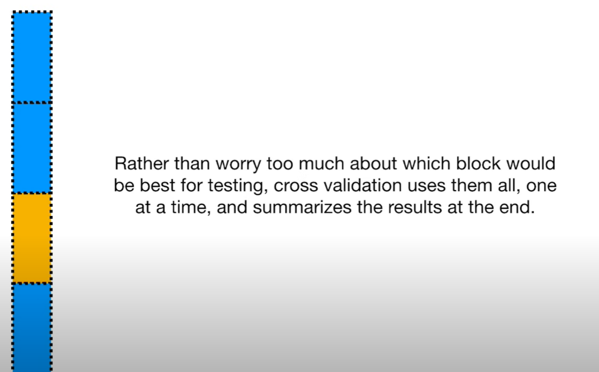
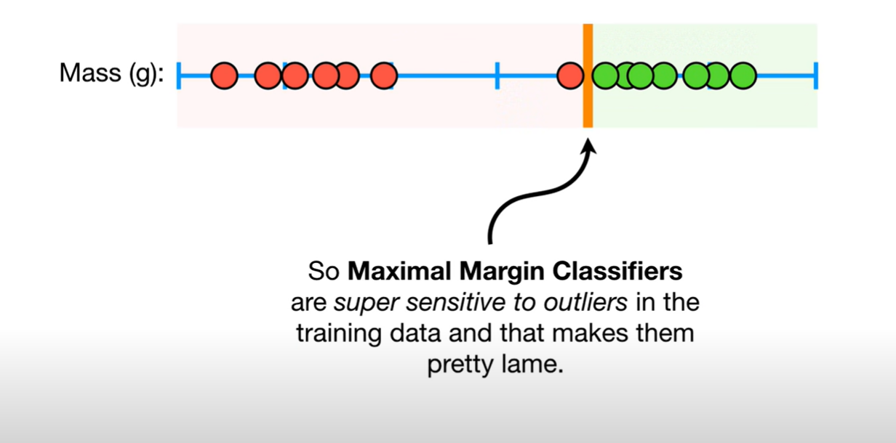

______________________________________________________________

# Bias and Variance in Machine Learnign.

Dado unos puntos de datos, por ejemplo si medimos y graficamos el peso y la altura de un conjunto de ratones obtendríamos este conjunto de datos:

Donde vemos que a medida que crecen el peso tiende a aumentar. Si quisieramos predecir la altura de un ratón dado el peso, para esto trazaremos una curva donde vamos a poder apreciar la tendencia de los datos. 

Inicialmente separamos los datos de prueba y entrenamiento para los algoritmos de ML. Los azules son de entrenamiento, los verdes de prueba.

Veamos el caso del algoritmo de  regresión lienal o "Mínimos cuadrados", este intenta ajustar una linea a la tendencia, la linea no tien ela flexibilidad para curvarse. Así la línea no captará la relación entre el alto y el peso de los ratones, independientemente de que tanto se entrene. A esta discapacidad para capturar la relación, le llamamos **Sesgo o Bias**.

Algún método cualquiera de machine learning podría hacer el caso contrario, de ajsutarse mucho a los datos de entrenamiento.

Al captar mejor la relación podmeos decir que esta curva tiene menor sesgo.

Si fuesemos a comparar la distancia d elso puntos del conjuto de datos de entrenamiento a la lineal tendríamos que la linea curva es mejor.

Pero esto es para el caso de datos de entrenamiento, si comparamos con los datos de prueba, tendríamos algo así:

Al calcular la suma de cuadrados, neuvamente, la regresión lineal tendría mejor relación.

En Machine learning la diferencia entre los ajustes entre los datasets es llamado **variance**, resulta de tener grandes sumas cuadradas.

A esta línea curva debido a que se ajusta muy bien a todos lso puntos se le llama **overfit**. El algoritmo ideal tiene bajo sesgo y baja varianza, puede con bastante consistencia hacer predicciones, al encontrar el **sweet point** entre un modelo complejo y uno simple. 

Para esto usaremos:

- Regularización
- Boosting
- Bagging.

# Cross Validation.

Supongamos que tenemos un dataset sobre enfermedades cardiacas,  y queremos saber si cuando viene un paciente nuevo este sufre de una enfermedad caridaca o no.

Queremos escoger el mejor algoritmo de clasificación. Regresión logistica, KNN, o SVM.

¿Como decidir cual usar?.

Cross Validation nos permite escocger cual algoritmo es mejor y tener un sentido sobre el mejor.

- 1. Estimar parametros le llamamos entrenar el algoritmo
- 2. Evaluar que también el modelo, puede categorizar nueva data, esto es testear el modelo.

Así que necesitamos entrenar y probar los metodos de machine learning. El bloque azul representa toda la data, las lienas particionadas representan el conjunto de datos que se usará para entrenamiento, y el amarillo para tes.

Esta técnica lleva la cuenta de qué tambien el modelo fue entrenado con la data y como de bien hizo la predicción con los datos de prueba.

Al final se trata con todos los segmentos de datos, y lleva registro de esas acciones.

En este caso el SVM hizo el mejor trabajo y lo usaríamos. 

Podemos dividir la data en diferentes bloques de datos, lo que da paso a diferentes tipos de Cross Validation. Es muy común dividirlo en 10 fold cross Valitaion.

- Los tunning parameters, son valores que no son estimados, es más como una adivinación educada. Ridge Regression.

# Support Vector Clasifiers and Support Vector Machines.

Supongamos que queremos clasificar los ratones por su masa, donde los ratones verdes son obsesos y los rojos nos, si los ubique en un plano respecto a sus masas puedo saber en que parte de la división ponerlos. Al margen que los divide se le llama **Maxium Margin Classifier** una división que existe para ampliar el rango de claisficación.

¿Qué pasa con las nuevas meustras de ratones?

Para que el MMC no sea tan sensible a los outliers debemos permitir clasificaciones-errorneas, este umbral de errores permitidos es un ejemplo del tradeoff que exste en ML sobre **sesgo-varianza**.

Cuando permitimos estas clasificacioens erroneas, la distancia de las observaciones a el umbral se llama **Soft Margin**, para saber cual **Soft Margin** es mejor, usaremos Cross-Validation para determinar la mejor clasificación dado diferentes margenes, estos margenes son los SVC, o **support vector classifier.**

)

Aquí tenemos los datapoints si tuviera una segunda medición, estaríamos hablando de data en 2D.

Cuando la data está en dos dimensiones, el SVC es una línea.

En 3 dimensiones la representación del SVC es un plano.

Podemos clasificar nuevas observaciones al situarlos en un lado del plano. Al tener más dimensiones, como nuestro data set de enfermades cardiacas, tendríamos dimensiones no concebibles por nosotros, en matemática puntualmente podemos hablar para  más dimensiones estamos habalndo de un hiperplano. Tecnicamente todo los los planos del subespacio son hiperplanos. Una línea es un hiperplano de 1 dimension. 

Los SVC pueden manejar outliers y clasificaciones erroneas. ¿Pero que pasa cuando tenemos este tipo de distribución en la data?

En este caso miramos los pacientes curados por un medicamento. Rojos no sirvio, verdes curados.

Los SVC no pueden realizar operaciones con esta data. Aquí es donde entran los **Support Vector Machine**

Al elevar al cuadrado cada datapoint u observaciones tamos mapeando en el eje y y ahora la data tiene dos dimensiones.

Así podríamos separar con un SVC la gente que fue curada de la que no.

- Empezamos con una baja dimensionalidad.
- Nos movemos a otras dimensionalidades.
- Usamos el SVC para clasificar las observaciones.

¿Por qué usar $dasage^2$.?, ¿Como usar qué transformación es la que necesitaremos?

- Las **Funciones Kernel**, son usadas dentro de los SVM para sistemáticamente encontrar los SVC en altas dimensiones.

- Los kernels polinomicos aumentan la dimensionalidad con el parámetro d.

- También tenemos el **Radial Basis Kernel**, encuentra SVC en infinitas dimensiones, esta mira la cercanía de las observacioens, pareceio al KNN para entender las relacioens con lso otros datapoitns.

Se calcula como si hubiese sido la data transformada. A este truco se le llama **Kernel Trick.**, al cpalcular relaciones de alta dimensionalidad sin tranformar la data a altas dimensionalidades. Este reduce la cantidad de cómputo realizar por el SVM.