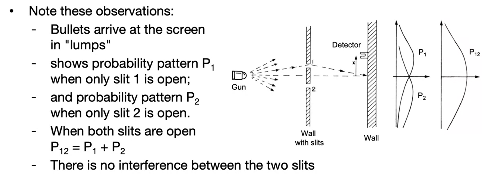
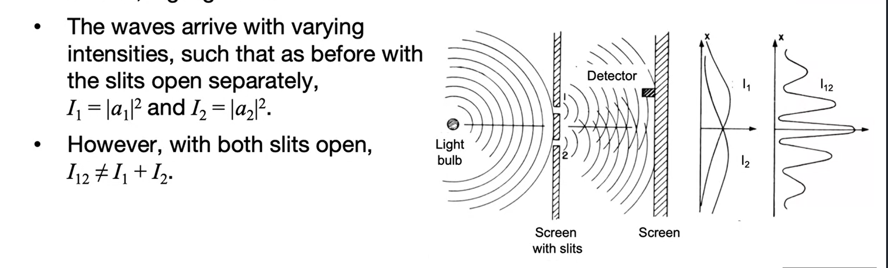
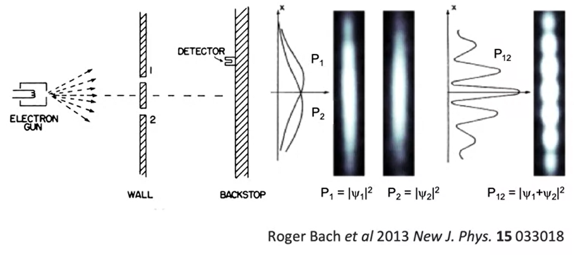

# Dualidad Onda partícula

Si estudiamos el comportamiento de una partíucla y tenemos un arma que está disparando a una pared con dos rendijas, podemos describir el objeto en términos de probabilidad, sabemos que las balas llegan en "paquetes" y que podemos obtener una distribución. 

Si tenemos amabas rendijas abiertas la distribución que obtenemos de los impactos es suma de ambas probabilidades.

Al hacer el mismo experimento con una onda continua
las ondas llegan una intensidad $I$, definida por la amplitud al cuadrado.

$I$ tiene un máximo así como $p$ y disminuye a medida que se aleja del centro. Esto pasa cuando tenemos una sola renidja abierta, al tener las dos abiertas obtenemos un "**patrón de interferencia**"  que muestra estos máximos.

$$I_{12} \ne I_{1} + I_{2} $$

Si ahora realizamoes el experimento con una pistola de electrones tenemos qué:

1. Los electrones llegan en paquetes cuando se mide con un detector movible.

2. Los patrones de interferencia al tener la dos rendijas abiertas siguen apareciendo aun cuando solo se le permite a un electrón impactar.

3. ¿Cómo explicamos el comportamiento?

Para explicar esto tenemos la regla de Born,  es posible expresar un electron con su función de onda $\psi(r)$

¿Qué representa esta función de onda?

- La probabilidad de encontrar un electrón en una posición r es proporcional al módulo al cuadrado de la función de onda. 
  
$$|\psi|^2$$

-  Al usar este módulo cuadrado nos aseguramso que siempre tendremos esta parte real y positiva d euna cantidad.
   -  Es consistente con la teoría electromagnética en la cual **El cuadrado de la amplitud es la intenisdad de una onda electromagética**
   -  Amplitudes complejas indican la magnitud y fase del campo.

### Normalización

Específicamente $|\psi(r)|^2$ es definido como la probabilidad por unidad de volumen, de en contrar una partícula . Es una "**densidad de  probabilidad**" 

- Para una particula de volumen infinitesimal $dr$ la probabilidad de entonctrar esta partícla en un volumen es proporcional a $|\psi(r)|^2dr$

La probabilidad de todos los eventos es igual a la unidad, o a esto le llamaos condición de normalización.

$$\int |\psi(r)|^2dr =1$$

- Una onda que satisface la condición de arriba le llamamos una onda normalizada. 

- Una onda puede ser normalizada al multiplicar constantes complejas.

### Postulado de Broglie.

Sobre la dualidad onda partícula De Broglie tiene que la hipotesis de la materia viene dada por

$$\lambda= \frac{h}{p}$$

El experimento fue demostrado por difracción de electrones esto es usado en cristalografía en al catacterización de materiales.

### Time-Independent Schordinger Equation

$$[- \frac{h^2}{2m} \triangledown^2 + V(r)]\psi(r) =  E\psi(r)  $$

- Se llama operador Hamiltoniano
- Consiste en el término que contiene el operador diferencial $\triangledown^2$
- Energía potencial  dada por el término de $V(r)$

Ahora, la tarea es reoslver la ecuación para obetener la función $\psi$ y la constante $E$ al mismo tiempo, en álgebra, a estos problemas se llaman ecuaciones Eigenvalue $E$ y Eigenfunction $\psi(r)$

El operdor Hamiltoniano a veces indica energía, a veces no referimos a este como E de energía-eigenvalue y a la función Energy-Egenfunction

#### 1D Infinite potential Well Problem

La solución general es dada por 

$$\psi(z) = A \sin(kz) + B\cos(kz)$$

Donde 

- $$k = \sqrt{2mE/h^2}$$

Para poder solcuioanr se requiere que la función de onda sea continua en los límites del "pozo"

$$\psi(z=0)=\psi(z=L)=0$$

La segunda condición es que 

# La Ecuación tiempo-independiente de Schördinger

# 1-dimensional potential well

# Ortogonalidad

# Normalización

# Completeness

# Linear Operators

# Hilbert Space